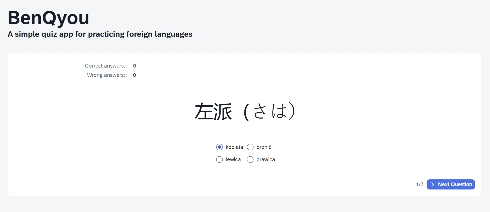

# BenQyou v.1.0.0

A simple quiz app for practising foreign languages.

## About

I created this app for my own purposes so it is not super complexed but feel free to use it or fork it! The idea was simple: you have to upload key-value pairs and you'll get a quiz.

### Features implemented - quick overview

✔ import .txt files

✔ import .PDF files

✔ edition of the list possible from the app

✔ random order of questions and answers

✔ counting your points



### The name

The app was designed for myself to learn Japanese words. "Benkyou" means "to learn" in Japanese so I added Q which stands for Quiz :)

## How to use

The app is hosted here:

tba

And you can simply use the app directly from the link. Please prepare .txt or .pdf file with key-value pairs. Each key-value pair should be on a separate line, with the two words in a pair separated by the "=" character.

See the example below:

家 = house

電気 = electricity

大学 = university

...

Please enter more than 4 examples. You can edit some words or delete them from your list from the app before starting the quiz as shown below. Make sure that there are no empty words.


Then you can start the quiz. You will see questions in random order with randomly choosen answers (one is correct). Press `Next Question` to check the answer and go next.

## Development

The application is built with SAP UI5 framework following MVC pattern. Loaded data is stored in a JSON model called `loaderModel`. There are 2 Views and its Controllers in this app:

**Main** - responsible for loading the data

**Quiz** - contains the whole quiz logic

App was developed with JavaScript language.

### Run locally

To run app locally, you need NodeJS installed. You can run the app locally simply with

```bash
npm start
```

command. By default, app should be opened in `http://localhost:8080/index.html`. Please, don't open the app with fiori launchpad sim `test/flp.html#app-preview` because it will cause some issues with the PDF library.

### JSDoc

I used JSDoc comments. You can install JSDoc:

```bash
npm install jsdoc --save-dev
```

And then, you can generate a code documentation with running

```bash
npx jsdoc webapp/controller -d docs
```
